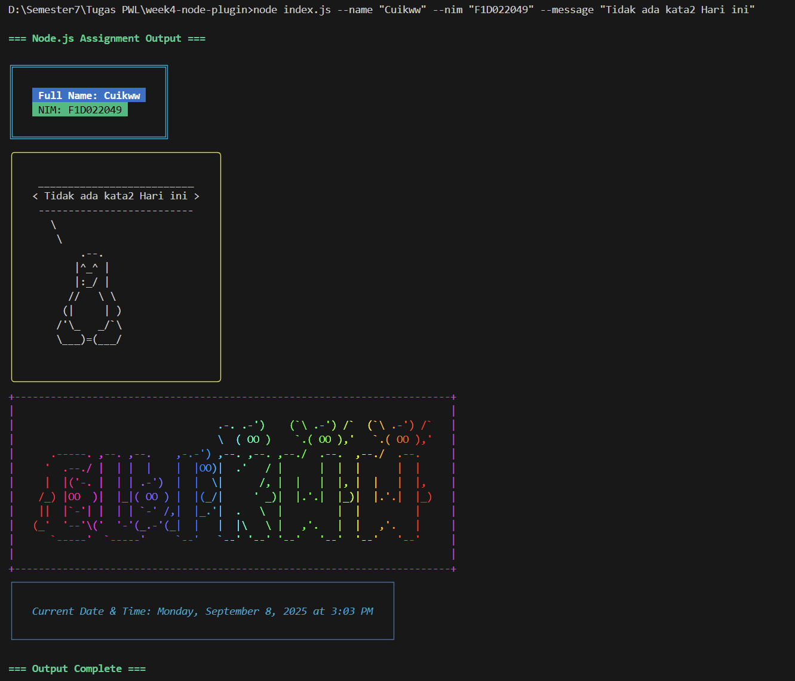

## Instalasi

1.  **Buat Folder & File Proyek**
    * Buat sebuah folder baru untuk proyek Anda: `mkdir tugas-nodejs`
    * Masuk ke dalam folder tersebut: `cd tugas-nodejs`
    * Buat file baru bernama `index.js` dan **salin seluruh kode JavaScript** ke dalamnya.

2.  **Inisialisasi Proyek Node.js**
    Jalankan perintah ini untuk membuat file `package.json`. File ini penting untuk mengelola dependensi Anda.
    ```bash
    npm init -y
    ```
    *(Anda juga bisa menggunakan `pnpm init` atau `yarn init`)*.

3.  **Instal Dependensi Secara Manual**
    Karena Anda memulai dari awal, Anda perlu menginstal setiap package yang dibutuhkan satu per satu. Jalankan salah satu perintah di bawah ini:

    **Menggunakan pnpm:**
    ```bash
    pnpm add chalk cowsay figlet gradient-string dayjs boxen yargs
    ```

    **Atau menggunakan npm:**
    ```bash
    npm install chalk cowsay figlet gradient-string dayjs boxen yargs
    ```

    **Atau menggunakan yarn:**
    ```bash
    yarn add chalk cowsay figlet gradient-string dayjs boxen yargs
    ```
    Setelah semua package terinstal, proyek Anda siap digunakan.

## Cara Penggunaan

Anda dapat menjalankan skrip ini dengan beberapa cara melalui terminal.

#### 1. Menjalankan dengan Semua Nilai Kustom
Ini adalah cara paling lengkap untuk menguji skrip, di mana Anda memberikan semua data yang dibutuhkan.

```bash
node index.js --name "I Nengah" --nim "F1D022049" --message "Keep learning, never settle."
```

#### 2. Menjalankan Hanya dengan Nama dan NIM
Jika Anda tidak memberikan `--message`, skrip akan menggunakan pesan motivasi default.

```bash
node index.js --name "Cuikww" --nim "F1D022049"
```

## Screenshot





